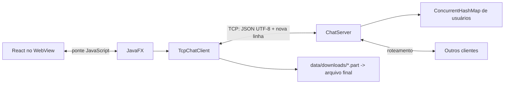

# Arquitetura

## Visão geral

O sistema tem dois executáveis. `ChatServer` abre um `ServerSocket`, aceita clientes TCP e entrega cada socket a uma tarefa do `ExecutorService`. `ChatApplication` abre uma janela JavaFX, carrega o frontend React no WebView e delega a rede ao `TcpChatClient`.

## Servidor TCP e concorrência

O servidor cria `Executors.newCachedThreadPool()` e submete uma tarefa por conexão aceita. A tarefa lê linhas completas com `BufferedReader`; portanto, não supõe que uma chamada de baixo nível a `read()` corresponda a uma mensagem. O registro de usuários é um `ConcurrentHashMap`, indexado pelo nome em minúsculas.

O `putIfAbsent` torna atômica a verificação e a inclusão do nome. Cada `ClientConnection` possui um lock exclusivo de escrita. Assim, diferentes threads podem enviar para o mesmo cliente sem misturar JSON no fluxo, e nenhum lock global fica retido durante I/O de rede.

No `finally` do atendimento, o servidor remove a associação somente se ela ainda aponta para aquela conexão. Isso evita usuários fantasmas e notificações duplicadas. A mesma rotina atende saída normal, reset do socket e fim inesperado do fluxo.

## Fluxo de mensagens

1. O cliente abre o socket e envia `LOGIN`.
2. O servidor valida o formato do nome e executa `putIfAbsent`.
3. Em caso de sucesso, responde `LOGIN_OK`, notifica `USER_JOINED` aos demais e publica `USER_LIST`.
4. Em `BROADCAST`, cria `CHAT_MESSAGE` e envia a todos, inclusive ao remetente.
5. Em `PRIVATE_MESSAGE`, localiza o destino sem diferenciar maiúsculas e envia somente ao remetente e ao destinatário.
6. O servidor sempre obtém `from` da conexão autenticada; um cliente não pode escolher o remetente.

## Fluxo de arquivos

O cliente lê o arquivo por blocos brutos de 24 KiB, atualiza um SHA-256 incremental e envia cada bloco em Base64. O servidor acompanha proprietário, destinatário, índice esperado, bytes recebidos e digest, encaminhando somente transferências válidas.

O destinatário cria um arquivo `UUID.part`, valida a ordem, escreve os bytes à medida que chegam e calcula outro SHA-256. Somente após `FILE_END`, tamanho e hash corretos o `.part` é renomeado. Falhas apagam o temporário e viram eventos de erro, sem encerrar a conexão do chat.

## Interface e ponte JavaScript

O build Vite gera HTML, CSS e JavaScript estáticos em `src/main/resources/web`. O WebView carrega `/web/index.html` diretamente do classpath; não existe HTTP local.

`JavaScriptBridge` expõe conectar, desconectar, enviar mensagens, selecionar arquivo e abrir arquivo recebido. Ela apenas coordena UI e `TcpChatClient`; regras de protocolo continuam fora da interface. `FrontendNotifier` é o ponto único de Java para React e executa `window.receiveChatEvent(...)` por `Platform.runLater`, respeitando a thread do JavaFX.
